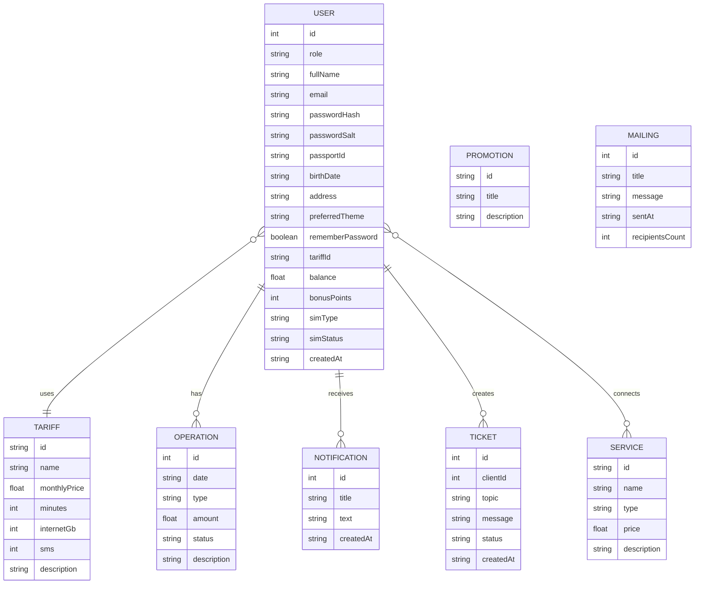

# Материалы для дипломной работы

## 1. Краткая характеристика системы

Разрабатываемая система `Velaris Mobile Care` представляет собой веб-приложение для технического сопровождения абонентов мобильной связи. Основная цель проекта — упростить взаимодействие клиентов и сотрудников оператора связи за счёт переноса большинства типовых операций в единое цифровое пространство.

Система поддерживает две основные роли:

- `Клиент` — пользователь личного кабинета, который может регистрироваться, получать мобильный номер, подключать тарифы и услуги, пополнять баланс, просматривать историю операций, обращаться в техническую поддержку и управлять несколькими номерами.
- `Администратор` — сотрудник оператора, который может искать клиентов, редактировать их данные, менять тарифы и услуги, отслеживать задолженность, изменять статус SIM-карт, обрабатывать обращения и выполнять рассылки.

## 2. Пояснение архитектуры

Архитектура приложения построена по клиент-серверной модели.

### Основные компоненты архитектуры

1. `Клиентская часть`

Клиентская часть реализована с использованием `HTML`, `CSS` и `JavaScript`. Она отвечает за:

- отображение интерфейсов клиента и администратора;
- обработку действий пользователя;
- отправку HTTP-запросов на сервер;
- отображение данных, полученных от сервера;
- переключение светлой и тёмной темы.

2. `Серверная часть`

Серверная часть реализована на `Node.js` с использованием встроенного модуля `http`. Сервер выполняет:

- обработку маршрутов API;
- регистрацию и авторизацию пользователей;
- генерацию уникальных белорусских номеров;
- изменение тарифов, услуг, баланса и статусов SIM;
- работу с обращениями в поддержку;
- массовые рассылки;
- выдачу статических файлов интерфейса.

3. `Подсистема хранения данных`

В качестве хранилища используется локальный `JSON`-файл. Такой подход подходит для дипломного прототипа, так как позволяет:

- не использовать внешнюю СУБД;
- упростить развертывание проекта;
- наглядно показать структуру данных;
- быстро демонстрировать работу приложения.

### Логика взаимодействия

Пользователь открывает веб-приложение в браузере, после чего интерфейс отправляет запросы на сервер. Сервер обрабатывает запросы, обращается к JSON-хранилищу, изменяет или извлекает данные и возвращает результат в формате `JSON`. Затем клиентская часть обновляет отображаемую информацию без необходимости ручного изменения данных.

### Схема архитектуры

## 3. UML / Use Case диаграмма

Ниже представлена диаграмма вариантов использования системы.

```mermaid
flowchart TD
    client["Клиент"]
    admin["Администратор"]

    uc1["Регистрация и получение номера"]
    uc2["Вход в личный кабинет"]
    uc3["Просмотр баланса и истории операций"]
    uc4["Выбор тарифа"]
    uc5["Подключение и отключение услуг"]
    uc6["Пополнение баланса"]
    uc7["Отправка обращения в поддержку"]
    uc8["Управление личными данными"]
    uc9["Подключение нескольких номеров"]

    ua1["Поиск клиентов"]
    ua2["Редактирование данных клиента"]
    ua3["Изменение тарифа клиента"]
    ua4["Подключение и отключение услуг клиенту"]
    ua5["Изменение статуса SIM-карты"]
    ua6["Просмотр задолженности"]
    ua7["Обработка обращений"]
    ua8["Создание рассылки"]

    client --> uc1
    client --> uc2
    client --> uc3
    client --> uc4
    client --> uc5
    client --> uc6
    client --> uc7
    client --> uc8
    client --> uc9

    admin --> ua1
    admin --> ua2
    admin --> ua3
    admin --> ua4
    admin --> ua5
    admin --> ua6
    admin --> ua7
    admin --> ua8
```

## 4. ER-диаграмма базы данных

Для прототипа данные хранятся в JSON, однако логическая структура соответствует реляционной модели и может быть легко перенесена в СУБД.

### Основные сущности

- `User` — пользователь системы;
- `Tariff` — тарифный план;
- `Service` — дополнительная услуга;
- `OperationHistory` — история финансовых и сервисных операций;
- `Ticket` — обращение в техническую поддержку;
- `Notification` — уведомление пользователя;
- `Promotion` — акция;
- `MailingHistory` — история массовых рассылок.

### ER-диаграмма

## 5. Описание бизнес-процессов

### 5.1 Регистрация клиента

1. Пользователь открывает форму регистрации.
2. Вводит ФИО, email, пароль и дополнительные данные.
3. Система проверяет уникальность email.
4. Генерируется уникальный белорусский номер.
5. Пользователю автоматически назначается eSIM-статус.
6. Данные сохраняются в хранилище.

### 5.2 Работа клиента в личном кабинете

После авторизации клиент может:

- просматривать текущий тариф;
- подключать и отключать дополнительные услуги;
- пополнять баланс;
- отслеживать начисление бонусов;
- просматривать историю операций;
- подавать обращения в поддержку;
- редактировать личные данные;
- подключать дополнительные номера.

### 5.3 Работа администратора

После авторизации администратор может:

- искать клиента по имени, email или номеру;
- видеть клиентов с отрицательным балансом;
- редактировать персональные данные клиента;
- менять тариф и набор подключённых услуг;
- изменять статус SIM-карты;
- просматривать и обрабатывать обращения;
- отправлять массовые уведомления клиентам.

## 6. Обоснование выбора технологий

### 6.1 Почему выбран Node.js

`Node.js` был выбран в качестве серверной платформы по следующим причинам:

- высокая скорость разработки;
- возможность использовать один язык программирования (`JavaScript`) и на клиенте, и на сервере;
- встроенные модули позволяют реализовать прототип без внешних зависимостей;
- простой запуск на любой современной машине, где установлен Node.js.

Для дипломного проекта это особенно важно, так как приложение должно быть легко разворачиваемым и демонстрируемым.

### 6.2 Почему выбраны HTML, CSS и JavaScript

Эти технологии являются базовыми средствами веб-разработки и позволяют:

- создать современный адаптивный интерфейс;
- реализовать светлую и тёмную темы;
- обеспечить интерактивное поведение без перегрузки проекта лишними библиотеками;
- сосредоточиться на бизнес-логике системы.

### 6.3 Почему выбрано JSON-хранилище

Использование `JSON` в дипломном проекте оправдано тем, что:

- не требуется установка отдельной СУБД;
- данные можно легко просматривать и анализировать;
- структура сущностей хорошо читается и подходит для демонстрации;
- прототип легко переносится на другой компьютер.

При необходимости в дальнейшем проект может быть масштабирован и перенесён на `PostgreSQL`, `MySQL` или другую реляционную СУБД.

### 6.4 Почему выбрана клиент-серверная архитектура

Клиент-серверная архитектура позволяет:

- разделить интерфейс и бизнес-логику;
- централизованно обрабатывать данные;
- обеспечить удобное расширение системы;
- реализовать разные роли пользователей в рамках одного проекта.

Такой подход соответствует современным принципам построения информационных систем.

## 7. Преимущества разработанной системы

- уменьшение нагрузки на сотрудников за счёт самообслуживания клиентов;
- ускорение типовых операций;
- централизованное хранение информации о клиентах;
- сокращение времени на поиск и обработку данных;
- удобное управление номерами, услугами и тарифами;
- повышение качества взаимодействия между клиентом и оператором.

## 8. Возможные направления развития

В дальнейшем систему можно расширить следующими функциями:

- интеграция с полноценной СУБД;
- SMS-подтверждение регистрации и входа;
- онлайн-оплата через платёжный шлюз;
- чат с оператором в реальном времени;
- отчёты и аналитика для администратора;
- разграничение прав между несколькими категориями сотрудников;
- интеграция с CRM мобильного оператора.

## 9. Заключение

Разработанное веб-приложение `Velaris Mobile Care` решает задачу цифровизации процессов обслуживания абонентов мобильной связи. Система объединяет функции самообслуживания клиента и инструменты администрирования в одном продукте, что делает её удобной как для конечных пользователей, так и для сотрудников оператора.

Полученный результат можно использовать как полноценный дипломный прототип, который демонстрирует архитектуру, бизнес-логику, интерфейсное разделение ролей и работу с пользовательскими данными.
